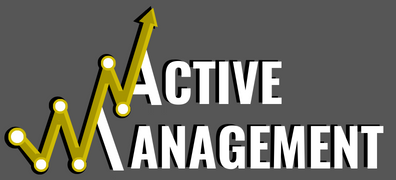

# Analise de Portfólio de Ações e Previsão com Series Temporais

#### Tenha acesso a toda análise no meu portfólio de projetos clicando aqui [**PORTFÓLIO**](https://sites.google.com/view/portflio-wiliams-alves/in%C3%ADcio).

### Problema de negócio:
 - O CEO gostaria de maximizar os resultados oferecendo um portfólio rentável a seus clientes, onde eles possam visualizar o desempenho da carteira de ações no período analisado e ter a possibilidade de fazer simulações de rendimentos, tanto para o passado quanto para o futuro, para isso o CEO nos deixou algumas perguntas, que foram:

1.  Quais ações compõem o portfólio?
2.  Qual a taxa de retorno, volatilidade e índice sharpe ratio do portfólio?
3.  Quais os pesos de cada ação do portfólio?
5.  Qual a simulação de rendimentos do portfólio dos últimos 5 anos com capital mínimo de 100,00?
6.  Qual a simulação de rendimentos para os próximos 365 dias aplicando capital mínimo de 100,00?

#### Para responde-las foi feito deploy do data_app.py em nuvem, acesse clicando aqui [**DATA_APP**](https://alves05-portfolio-analysis-and-forecasting-data-app-j8tzig.streamlit.app/).
 
### Análise Exploratória de Dados:

 - O critério de seleção das ações que irão compor o portfólio será análise técnica de gráfico, onde selecionaremos apenas as ações que estiverem em tendência de alta, ou seja, com o preço acima da linha de tendência de alta, após essa primeira seleção serão analisadas as ações que tenham correlação abaixo de 0.5, pois para ter um portfólio bem diversificado, temos que garantir que os ativos que o compõem tenham baixa correlação entre si.

### As hipóteses levantadas durante análise exploratória são:**
    
1. Quais ações estão em tendência de alta?
2. Existe ações com correlação menor ou igual a 0.5?
3. O portfólio mantém ações que obtiveram retornos positivos no período analisado?
4. Quais ativos apresentaram o maior e menor retorno?
5. Quais ativos apresentaram a maior e a menor volatilidade?
6. Obtivemos retorno de portfólio maior que o risco? Qual a fronteira de eficiência?
7. O indicador de risco/retorno sharpe ratio, mostrou resultado satisfatório? Onde acima de 1 o investimento pode ser recomendado e abaixo de 1 indica que o risco sobrepõe o retorno ficando inviável o investimento.
8. Simulando o rendimento dos últimos 5 anos, podemos afirmar que o portfólio foi rentável no período da análise?
9. Quais empresas tiveram maior peso no portfólio?

### Aplicação do algoritmo Prophet para previsão de Séries Temporais:

 - O algoritmo foi usado para fazer a previsão das cotações das ações selecionadas para o portfólio, criando uma base para simulações de possíveis rendimentos futuros. Saiba mais sobre acessando o site https://pypi.org/project/prophet/.
